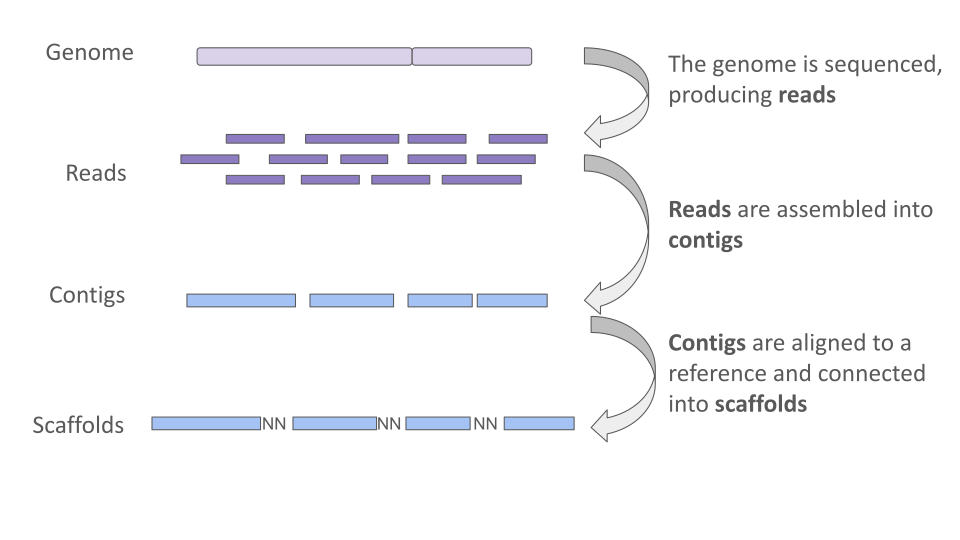

# Genome Assembly

Once your sequencing reads have been filtered for quality and length, the next step is to **assemble them into a draft genome**. Genome assembly is the process of stitching together overlapping sequencing reads to reconstruct the original genome. When we assemble a genome from scratch, without the aid of another reference genome, it is referred to as a *de novo* genome assembly. For Oxford Nanopore reads, which are long but can be error-prone, assemblers designed specifically for long reads (such as [Hifiasm](https://www.nature.com/articles/s41592-020-01056-5) or [Flye](https://www.nature.com/articles/s41587-019-0072-8)) are ideal.


## Genome Assembly: Key Terms



Let’s define some common terms you’ll encounter when working with genome assemblies.
During sequencing, an organism’s chromosomes are fragmented, and those fragments are sequenced by the platform to produce shorter stretches of nucleotide sequence called **reads**. In this project, we are using long reads, which can capture much larger fragments of continuous DNA sequence.
To reconstruct the genome, we use an assembler— in our case, **Hifiasm**. The assembler overlaps and stitches the reads together to generate a consensus sequence known as a **contig**. Ideally, each contig would represent the complete, continuous sequence of a chromosome. In practice, however, this is challenging because repetitive sequences can break assemblies when they can't be spanned by the reads, causing the assembler to produce fragmented contigs.
When a reference genome is available for the species, we can use it to help order and orient contigs relative to each other. This process is called **scaffolding**. Contigs are linked together into larger sequences (scaffolds), with unknown regions represented by runs of the letter N. Since we are working with *D. melanogaster* data, we can use the ISO1 reference genome to determine which contigs correspond to which chromosome/chromosome arm. 

*Note: One drawback of reference-based scaffolding is that it can make your assembly look more like the reference than it actually is. For example, if your sample has a big rearrangement or contains sequences that the reference is missing, these differences might get “forced” into the reference structure instead of being shown correctly. To get around this problem, scientists often use other data sources- like [Hi-C](https://www.cd-genomics.com/resource-hic-sequencing.html) data or optical mapping- to scaffold assemblies without relying on a reference genome. For this project, we’ll be using reference-based scaffolding, but it’s important to remember the potential limitations when interpreting the results.


In this project, we will:

- Use Hifiasm to assemble our long reads into contigs.

- Use RagTag to perform reference-guided scaffolding, ordering the contigs with the help of an existing reference genome.

## Prerequisites
- Ensure you have your filtered sequencing data and the required tools installed (see course software list).
- You'll need to have downloaded the *D. melanogaster* ISO1 reference genome from FlyBase (ex. dmel-all-chromosome-r6.63.fasta).


## Step 1. Run the Assembly
```bash
hifiasm --ont -o BL2969_hifiasm BL2969_ont_filt.fastq
```
- `--ont`: specifies that the reads are Oxford Nanopore R10 (high-quality) reads
- `-o`: specifies a name for output directory and **prefix** for the output files. In this example we are specifying strain name (BL2969) and the assembler (_hifiasm)
- `Input`: the filtered FASTQ file

## Output
Hifiasm will produce many files beginning with the **prefix** we specified using the **-o** option.

- `prefix.bp.p_ctg.gfa`: assembly graph of primary contigs.

- `prefix.bp.hap1.p_ctg.gfa`: partially phased contig graph of haplotype1.

- `prefix.bp.hap2.p_ctg.gfa`: partially phased contig graph of haplotype2.

- Log files documenting the assembly process

Hifiasm outputs **primary contigs** which represent the main assembly for each genomic region, while the **alternate contigs** (hap1, hap2) capture alternative haplotypes where heterozygosity was resolved into separate sequences.
These assemblies are in **GFA (Graphical Fragment Assembly)** format because genome assembly is not always a simple linear sequence. Instead, assemblies often contain alternative paths (for example, due to heterozygosity or repeats) that can’t be fully represented in a single linear FASTA file. GFA is a graph-based format that records **nodes (sequence segments)** and **edges (connections between nodes)**. This allows Hifiasm to capture the true structure of the assembly. Read more about Hifiasm output files [here](https://hifiasm.readthedocs.io/en/latest/interpreting-output.html)

## Step 2. Generate FASTA files from GFA
In order to perform the comparative genomic analysis we will do in later steps, we need to have a linear genome. We can do so by using a simple `awk` command which converts the graph representation of the genome assembly into a linear sequence which we can store in a FASTA file. For this tutorial we will work with the primary assembly (prefix.bp.p_ctg.gfa) instead of the alternates.

`awk '/^S/{print ">"$2;print $3}' prefix.bp.p_ctg.gfa > prefix_hifiasm_primary_contigs.fa`

- `^S`: Matches only lines in the GFA file that start with S. In GFA, S lines define sequence segments (nodes in the assembly graph).
- `{print ">"$2; print $3}`: For each S line, writes a FASTA-style header using the second column of the GFA line (the contig name) and writes the actual sequence (third column of the GFA line).

- `> prefix_hifiasm_primary_contigs.fa:` Redirects the output into a new FASTA file


## Step 2. View assembly FASTA
The **contigs** in your primary assembly file represent your preliminary draft genome — continuous sequences assembled from overlapping reads. Take a peek at your draft assembly file using `less`.

Example:
```text
>ptg000001l
GCTCCAGCACTCATAATAGACAGACAACAACTACCTAAAACTGCTAATGGTCTCCTCTGA
TGCAGATCCATCATCAGTATGTACTCCCACATGCAGAGCACACACACACACACACACACA
CACACACACACACACACACACACACACACACACACACACATATATATATTCCATAACTAA
...
```

Note that the sequences are given arbitrary names starting with **ptg**. That's because the genome assembler doesn't know which sequence belongs to a certain chromosome, or even which sequences are next to each other on a chromosome.

---

## Step 3. Scaffold the Assembly with RagTag
Once you have a set of contigs from your assembler, you can attempt to **order and orient them into scaffolds** using a reference genome. Scaffolding does not change the sequence of the contigs themselves but places them in context, making the draft assembly more chromosome-like.

We will use **RagTag**, a reference-guided scaffolding tool.

```bash
ragtag.py scaffold dmel_reference.fasta BL2969_hifiasm_primary_contigs.fa -o ragtag_BL2969
```
- `scaffold`: tells RagTag to run the scaffolding module
- `dmel-all-chromosome-r6.63.fasta`: the reference genome FASTA (ex. ISO1 reference)
- `BL2969_hifiasm_primary_contigs.fa`: your assembled primary contigs from Hifiasm, in this case from strain BL2969
- `-o`: name for the output directory

## Output
RagTag will produce a new directory which contains:
- `ragtag.scaffold.fasta`: the scaffolded assembly
- AGP and BED files describing the placements of contigs
- Log files detailing alignments and decisions made during scaffolding

You can change into the output directory and rename the scaffolded file for clarity:
```bash
# change into output dir
cd ragtag_BL2969
# rename file
mv ragtag.scaffold.fasta BL2969_hifiasm_primary_scaffs.fa
```
* Note: FASTAs files can end in `.fasta`, `.fna`, or `.fa`
---

## TO DO: Assemble and Scaffold all strains of interest
1. Modify the example code to assemble the genomes of your strain(s) of interest with Hifiasm.
2. Scaffold each assembly with RagTag using the appropriate reference genome.
3. Rename the outputs consistently for downstream analysis.
