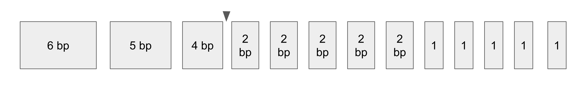

# Quality Checking Genome Assemblies


Once we've generated a de novo genome assembly, it's essential to evaluate its quality before using it in downstream analyses.

Genome assembly quality is typically assessed using three major criteria:
1. **Contiguity**
2. **Completeness**
3. **Accuracy**

---

## 1. Contiguity

With high sequencing coverage and long reads, an ideal genome assembly would represent each chromosome as a single contig. However, most assemblies contain gaps due to challenges in assembling repetitive regions. These unresolved gaps can limit our understanding of certain genomic regions and impact downstream analyses.

One commonly used metric for genome contiguity is the **contig N50**. This value represents the contig length at which **50% of the total assembly size is contained in contigs of that length or longer**.

Here's a simple example: Suppose our assembled genome is 30 bp in total. We list all contigs from longest to shortest:



Starting from the longest contig, we add their lengths until we reach at least half of the total genome size (15 bp in this case). If we reach 15 bp after including the third contig and that contig is 4 bp long, then the contig **N50 = 4 bp**. A related measure is **L50**, which is the **number of contigs needed to reach half the genome size**. In this example, since it took 3 contigs to reach 15bp, the **L50 = 3**.

**A higher N50 and lower L50 indicate a less fragmented and more contiguous genome assembly.**

We can compute metrics like N50, L50, total assembly size etc. using tools like **QUAST**:

```bash
quast -o BL2969_contigs_quast BL2969_hifiasm_primary_contigs.fa
```

- `-o`: output directory name
- `.fa`: the genome assembly in FASTA format

After running QUAST, navigate to the output directory and view the report with:
``` bash
less strain_contigs_quast/report.txt
```

Example of QUAST output: 
```text
Assembly                    drosophila_genome
# contigs (>= 0 bp)         22                              
# contigs (>= 1000 bp)      22                              
# contigs (>= 5000 bp)      22                              
# contigs (>= 10000 bp)     22                              
# contigs (>= 25000 bp)     22                              
# contigs (>= 50000 bp)     18                              
Total length (>= 0 bp)      135732031                       
Total length (>= 1000 bp)   135732031                       
Total length (>= 5000 bp)   135732031                       
Total length (>= 10000 bp)  135732031                       
Total length (>= 25000 bp)  135732031                       
Total length (>= 50000 bp)  135587543                       
# contigs                   22                              
Largest contig              28188642                        
Total length                135732031                       
GC (%)                      42.26                           
N50                         21823827                        
N75                         12649029                        
L50                         3                               
L75                         5                               
# N's per 100 kbp           0.00
```
This example shows a **D. melanogaster** assembly with 22 contigs and a total length of ~135.7 Mb. The N50 is 21.8 Mb and L50 is 3. For comparison, the reference strain ISO1 has an N50 of 21.5 Mb and L50 of 3, suggesting this assembly has comparable contiguity to the reference genome — a promising result!

## 2. Completeness
Completeness measures how much of the expected gene content is captured in the assembly. If essential genes are missing, it could compromise functional and evolutionary analyses.

BUSCO (Benchmarking Universal Single-Copy Orthologs) is commonly used to assess completeness. It searches for conserved, single-copy genes expected to be present in a given lineage (ex. the order *Diptera* for *Drosophila*).

To run BUSCO:

```bash
busco -i BL2969_hifiasm_primary_contigs.fa -m genome -l diptera_odb10 -c 24 -o dip_busco
```
-`-i`: input FASTA file (your assembly contigs or scaffolds)

-`-m genome`: mode set to genome analysis

-`l diptera_odb10`: lineage dataset for Diptera

-`c`: number of CPU threads

`-o`: output directory name

A completeness score above 95% is generally good; for model organisms like *D. melanogaster*, we expect values above 98%.

## 3. Accuracy
Accuracy refers to how well the assembled sequence reflects the true genomic sequence. While this tutorial won’t include hands-on accuracy evaluation, here are common methods:

**Read Mapping**: One way to assess assembly accuracy is to align the original sequencing reads back to the assembled genome. If the assembly is correct, you should see largely uniform coverage across each contig.

- A pileup of excess reads can indicate a collapsed duplication- where the assembler represented a repeated sequence only once, even though it actually occurs multiple times in the genome.

- A sudden drop in coverage may signal an incorrectly joined region (a misassembly), which sometimes needs to be corrected by breaking the contig at that point.

**Hi-C contact maps**: Hi-C sequencing is used to map the 3D structure of the genome. It can be used to examine long-range interactions in the genome to see if they support the contiguity and orientation of contigs.


Although we won’t perform these steps here, accuracy becomes increasingly important when resolving fine scale features such as single nucleotide polymorphisms (SNPs) and structural variants.

### TODO: Evaluate quality of *D. melanogaster* genomes
1. Run QUAST and BUSCO on each strain genome assembly (contigs or scaffolds)
2. Using metrics like N50, L50, and Complete BUSCO score, how do the genome assemblies compare to eachother? 
