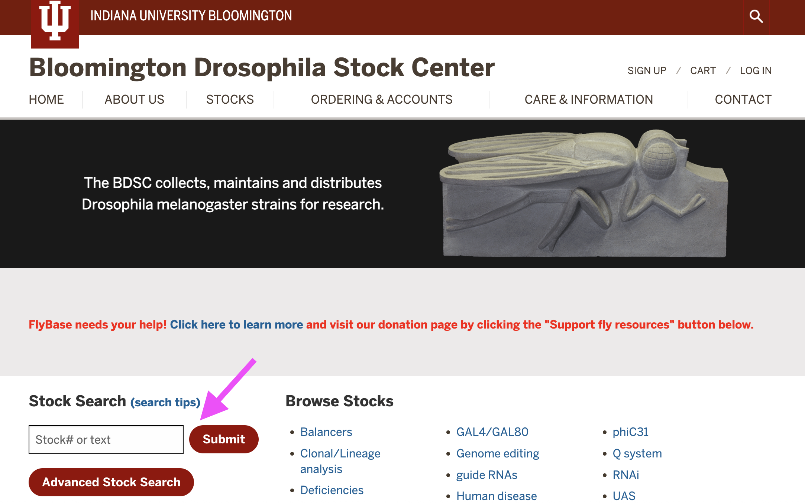
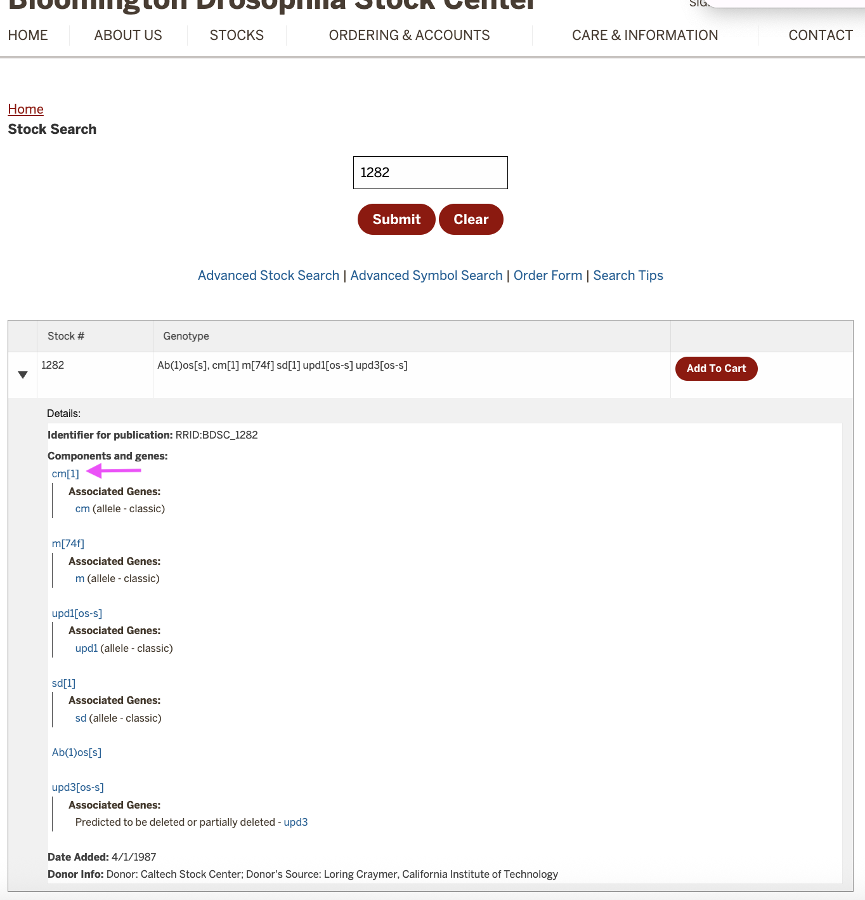
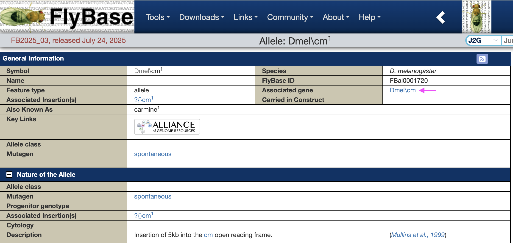
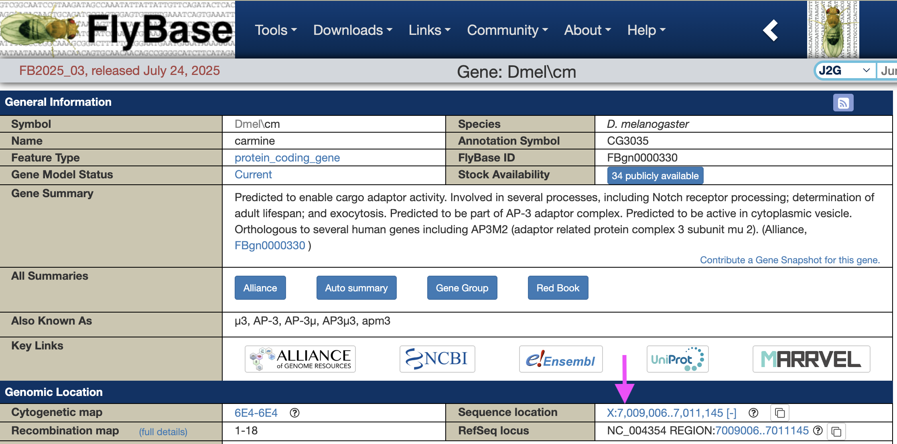
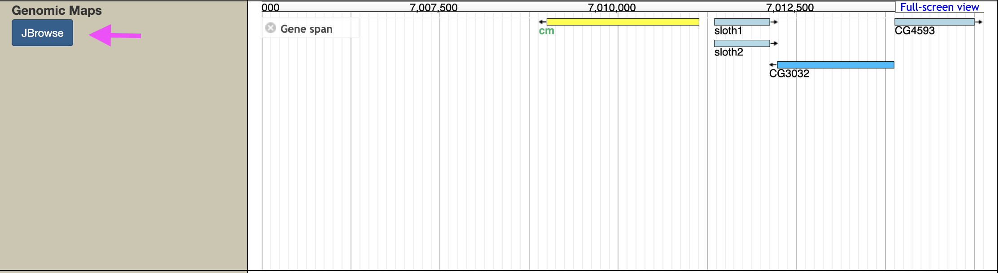
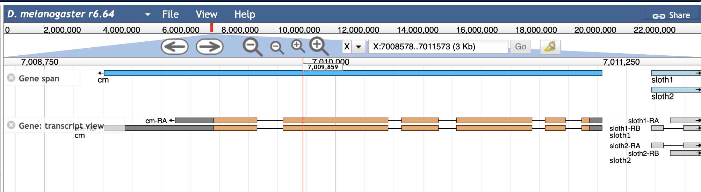

# Identifying Strain Alleles and Gene Coordinates in FlyBase

The sequenced strains used in this project each carry **alleles**, or gene
variants, which are linked to visible phenotypes such as eye color, body color, and
wing morphology. Over more than a century of *Drosophila* research,
genetic mapping has connected many of these traits to specific genes. In
some cases, the causative mutation itself is known; in others, the gene
has been mapped but not fully characterized, and in a few cases the
causative gene is still unknown.

Alleles are typically denoted by the gene name with a superscript number
or abbreviation. Many gene names reflect the mutant phenotype. For
example, *y*1 is an allele of *yellow*,
which causes yellow body color, while *ey*D
is a dominant allele of *eyeless* that produces reduced or absent eyes.

Using two key resources - the **Bloomington Drosophila Stock Center** (BDSC)
and **FlyBase** - you can determine which alleles are present in a strain
and locate their corresponding genes in the genome.

------------------------------------------------------------------------

## Objectives

1.  Identify the alleles carried by a *Drosophila melanogaster* strain
    using its BDSC stock ID.
2.  Find the genomic coordinates of those alleles in FlyBase.

------------------------------------------------------------------------

## Part 1: Identify Alleles from the BDSC Website

The BDSC maintains detailed information about thousands of *Drosophila*
strains. With a strain ID, you can quickly look up its alleles.

### Steps

1.  Go to the BDSC website:

    <https://bdsc.indiana.edu>

2.  Enter the strain number in the **Stock Search** bar (omit the "BL"
    prefix).

    -   Example: For strain BL1282, search for "1282."

        

3.  On the strain page, scroll to **Components and Genes**.

    -   This section lists the mutations in the strain and their
        associated genes. Click the **allele** name (contains brackets) to open
        its FlyBase page.

        

4.  The FlyBase allele page includes details such as the mutation's
    origin (ex. spontaneous, X-ray, or chemical mutagenesis) and, in
    some cases, the causative molecular change.

    -   Example: *carmine*1 is caused by a
        5 kb insertion within the gene's coding region.
    
     From here, click the **Associated Gene** link to open the gene
        page.

    

5.  Every annotated *Drosophila* gene has a dedicated FlyBase page. This
    includes its known or predicted function, biological pathways, and
    relevant publications.

    -   The **Sequence location** box shows the genomic coordinates.
    -   Example: *carmine* is located on the X chromosome at
        7,009,006 - 7,011,145.

        

6.  Below the **Sequence location** box, you'll find a link to JBrowse,
    FlyBase's genome browser. Click the **JBrowse** button to open an
    interactive view of the region.

    

7.  In JBrowse, you can view gene models with detailed transcript
    annotations:

    -   **Thick orange boxes** = coding sequence (CDS)
    -   **Gray boxes** = untranslated regions (UTRs)
    -   **Thin lines** = introns

    For example, the *carmine* gene has two transcript variants
    (*ca-RA*, *ca-RB*). If you identify an insertion at X:7,009,859, you
    can see in JBrowse that it falls within the coding sequence,
    suggesting it likely disrupts gene function.
    
    

**Key point:** The effect of a mutation depends on the region it
affects.
- **Coding sequence mutations** often disrupt protein function by
shifting the reading frame, introducing stop codons, or deleting
domains.
- **Non-coding mutations** may alter gene regulation (expression levels,
tissue specificity, etc), even if they don't change protein sequence.

------------------------------------------------------------------------

## Part 2: Record Gene Locations

Once you've identified a gene's location in FlyBase, you can save it in
a BED file for downstream analyses.

### 1. Create a BED File

Remember, a BED file is a simple tab-delimited format with at least three columns:

    chrom   start   end

**Important:** BED coordinates are **0-based, half-open**.
- Subtract 1 from the FlyBase start coordinate.
- Keep the FlyBase end coordinate as is.

### Example

FlyBase reports the *carmine (cm)* gene at:

    X:7,009,006..7,011,145

The corresponding BED entry would be:

    X    7009006    7011145    carmine

Where:
- `X` → chromosome
- `7009006` → start coordinate (FlyBase start -- 1)
- `7011145` → end coordinate
- `carmine` → optional gene name

**Note:** Later on, we will use this BED file to identify mutations affecting genes associated with visible phenotypes in each strain. A BED file can hold as many entries as you want, so it's a good idea to store the gene coordinates of all the genes carrying mutations in a strain. For example, you could store the coordinates for all genes linked to visible markers in strain BL1282 (*m*, *upd1*, *upd3*, *sd*) in a file called `BL1282_mutated_genes.bed`.

------------------------------------------------------------------------

##  TO DO

1. Looking up strain(s) in BDSC.
2. Record the alleles it carries and locate the gene coordinates in
FlyBase.
3. Create a BED file with the coordinates of the genes from your
strain(s).
