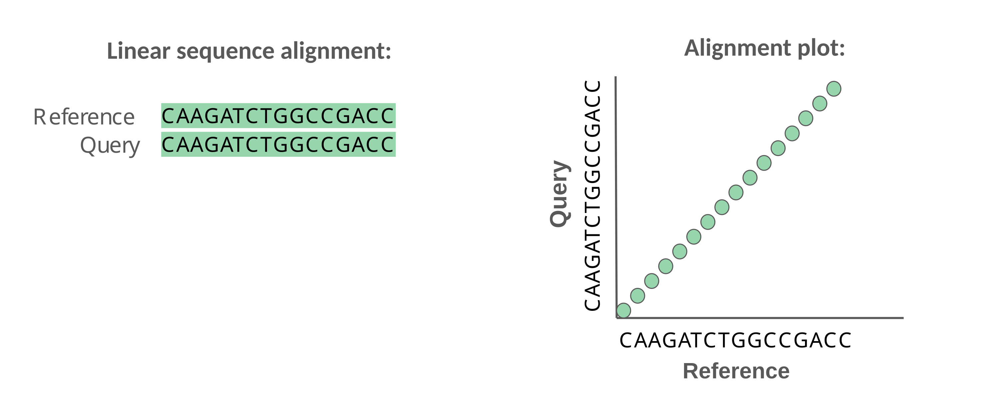
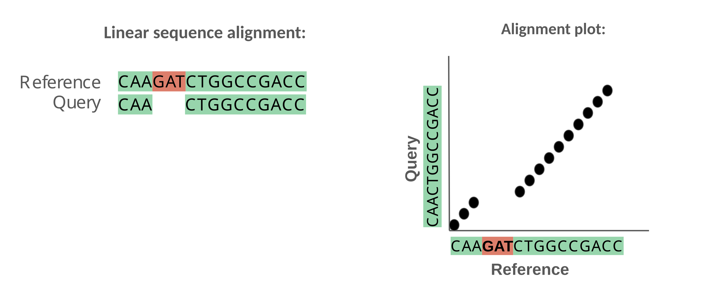
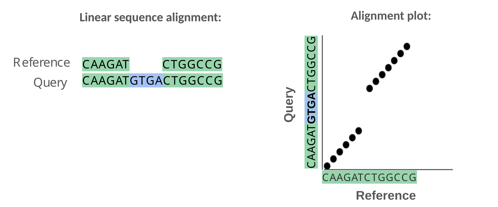
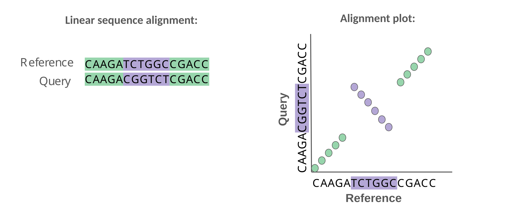
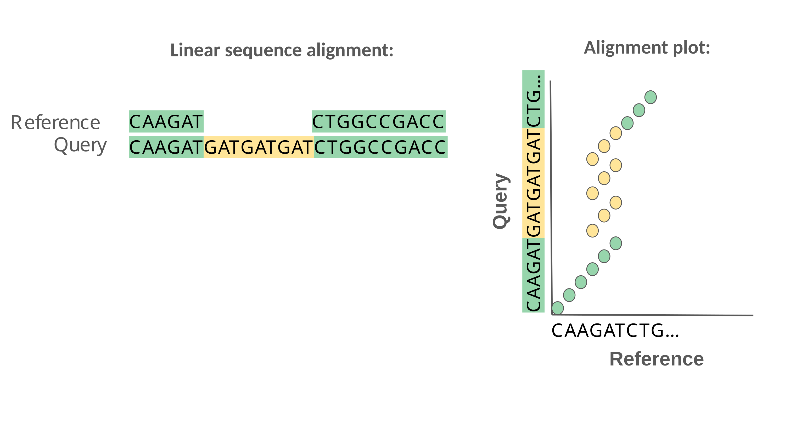

# Whole-Genome Alignment

Whole-genome alignment is one of the most direct ways to identify differences between genomes. Alignment software (ex. MUMmer, Minimap2, Cactus) takes two or more assembled genomes and searches for regions that are homologous (derived from the same ancestral sequence) which allows us to line up corresponding regions of the genomes. Once aligned, missing sequences, duplicated regions, or sequences that appear in a different order or orientation are identified. The result is typically an alignment file storing details about the start and end of alignments or a visualization (dotplot or graph) that clearly shows shared vs. unique regions of sequence. 
Here, we use whole-genome alignment to detect **large-scale structural variation (SVs)** such as **insertions, deletions, duplications, and rearrangements** by comparing our assembled genomes to the ISO1 reference.

## Objectives
1. Align *Drosophila* genome assemblies to the **ISO1 reference genome** using **MUMmer4**.  
2. Visualize alignment using **dot plots**.
2. Parse the alignment to identify structural variants (SVs) with **SVMU**.

---

## Prerequisites:
- Make sure you have the following files in your project directory:
  - The *D. melanogaster* **ISO1 reference genome** (FASTA).  
  Example: `dmel-all-chromosome-r6.52.fasta`

  - Your strain’s **de novo genome assembly** (FASTA).  
    Example: `BL662_hifiasm_flye_scaffs.fasta`

- If a conda is not being used and you are on a local machine, install Plotly:
  `pip install plotly`


## Step 1. Generate alignment file with MUMmer
First, we will use the program MUMmer to align our assembled genomes to the ISO1 reference.

### Align Genomes with MUMmer

We will use the **`nucmer`** command from MUMmer4 to align the query assembly against the reference genome.

```bash

# Run nucmer to align query assembly to the reference
nucmer -p BL662_vs_ISO1 dmel-all-chromosome-r6.63.fasta BL662_hifiasm_flye_scaffs.fasta
```

**Notes:**
- The `-p` option sets the output prefix. In this case, the results will be stored in `BL662_vs_ISO1.delta`.
- The `.delta` file contains detailed information about all alignments between the reference and the query.

---

## Step 2. Visualizing and interpreting dot plots

In Step 1, we aligned genomes using MUMmer, and the results were stored in a delta file. There are different ways to view this alignment:

- **Linear sequence alignments** are more appropriate for showing small variants such as SNPs and small indels in a small genomic region.

- **Dot plots**, however, are much more effective for identifying large scale mutations (≥100 bp) such as insertions, deletions, inversions, and duplications.

In a dot plot:

- The reference sequence is placed along the x-axis.

- The query sequence is placed along the y-axis.

- A point is added at every position where the two sequences are similar.

When the genomes share long stretches of homology (synteny), these points form a diagonal line. Deviations from this diagonal reveal structural changes.



---

### SVs in Dot Plots
For demonstration purposes, we’ll use small mutations to show how they would appear in the sequence vs how they appear in a dotplot. Keep in mind that these examples are simplified. In real dot plots, the sequences are much longer and the patterns we interpret (insertions, deletions, inversions, duplications) typically span hundreds to millions of base pairs.

#### Deletion in the query

- A sequence present in the reference (x-axis) is missing in the query (y-axis).

- Appears as a horizontal shift in the diagonal.



#### Insertion in the query

- A sequence is present in the query (y-axis) but absent in the reference.

- Appears as a vertical shift in the diagonal.



#### Inversion

- The same sequence is present in both genomes but reversed in the query.

- The diagonal flips direction.

- While inversions may be hard to notice in linear alignments, dot plots make even large inversions immediately visible.



#### Duplication in the query

- A sequence is present in multiple copies in the query.

- Appears as stacked parallel diagonals, each representing an additional copy aligning to the same reference region.



--- 

Dot plots are a powerful way to visualize whole-genome alignments and detect large structural variants (SVs). We'll use a python script included in this repository (dotplot_from_delta.py) that uses the alignment information from MUMmer to generate a dot plot.


## Running the Script

The script takes a `.delta` file as input and produces an HTML dot plot.

Example usage:

```bash
python dotplot_from_delta.py BL2969_vs_ISO1.delta --min_idy 90 --out BL2969_vs_ISO1.dotplot.html
```

### Key options:
- `--min_len` : minimum alignment length to plot (default = 1000 bp).  
- `--min_idy` : minimum percent identity (default = 0).  
- `--ref_contigs` : restrict to specific reference contigs.  
- `--qry_contigs` : restrict to specific query contigs.  
- `--out` : name of the output HTML file.


---

## Viewing the Output
The script generates an interactive HTML file, ex. `BL2969_vs_ISO1.dotplot.html`.  
Open it in your browser to explore the alignments:
- Hover over alignments to see coordinates, lengths, and % identity.

---

# Step 3. Identify Structural Variants with SVMU
Instead of looking through the alignment dot plots for mutations, we can automate the identification of SVs using programs that analyze the alignment file and call variants based on this information.

To extract specific **structural variants (SVs)** from the alignment, we will use **SVMU** (*Structural Variants from MUMmer*). A new version of the program is currently under development by the Chakraborty Lab, but for now we can use the currently available version.
First, make sure you have installed SVMU (see [GitHub](https://github.com/mahulchak/svmu) instructions).  

## Run SVMU
Here, we will define **variables**, short names to serve as stand-ins for a file name or path- in this case our reference, query, and the path to the SVMU executable file. After we have assigned a variable, we can use it later by adding `$` to the name.

```bash
# Define variables
ref=dmel-all-chromosome-r6.63.fasta
query=BL2969_hifiasm_primary_scaffs.fa
svmu=/scratch/user/asamano/dmel/tools/svmu/svmu

# Run SVMU on the delta file
$svmu BL2969_vs_ISO1.delta $ref $query l null BL2969_vs_ISO1
```
- `$svmu`: The variable that serves as a place-holder for the full path to the SVMU executable file.
- `*.delta`: Our delta file produced by MUMmer, in this case for strain BL2969
- `$ref`: The variable for the reference genome
- `$query`: The variable for the query genome
- `l`: Don't report SNPs
- `null`: We're not providing a lastz alignment, just the delta file from MUMmer so we set this to null
- `BL2969_vs_ISO1`: A prefix which will be included in all out SVMU output files


**Output:**

SVMU will generate variant calls describing insertions, deletions, copy number changes, and other SVs.  
*Taken from the SVMU GitHub page

- `sv.prefix.txt` = A tab-delimited file that summarizes structural mutations (indels, CNVs, inversions) in the sample genome with respect to the reference genome.  

- `small.prefix.txt`: A tab-delimited file containing SNPs and small indels that occur within syntenic blocks (or MUMs).

- `cnv_all.prefix.txt`: A tab-delimited file with all the reference genomic regions that are present in higher copy numbers (>1) in the sample genome. Those with "trans" in their names mean either that it is a transposable element or non-TE copies of a gene in different chromosomes.

- `cm.prefix.txt`: A bed file with the reference genomic regions that are syntenic between the two genomes. 

We will mainly focus on the **sv.prefix.txt** file, which contains the following columns:
1. Reference chromosome
2. Start position of SV in reference
3. End coordinates of SV in reference
4. SV type. Any SV type containing 'CNV' denotes a copy number variant, a sequence that is present at higher copy number in the reference (R) or query (Q).
5. Query chromosome
6. Start position of SV in the query
7. End position of SV in the query
8. Arbitrary ID assigned to that SV


---


# TO DO:
1. Practice identifying different SV types from dot plots and save images for your own reference.
2. Run SVMU on your strains of interest and check the dot plot at mutations called by SVMU to see if they appear as expected.