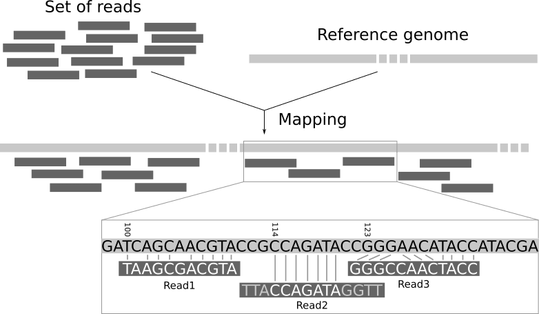

# Variant Calling with Read Mapping

Comparing whole-genome assemblies is the gold standard for identifying large genomic rearrangements. However, when genome assembly is not possible, a complementary approach called **read mapping** (or **read alignment**) is often used. This is one of the most widely applied methods in genomics, especially when working with short, paired-end reads.

In read mapping, sequencing reads are aligned directly to a reference genome. Differences between the reads and the reference indicate potential variants. 




Even when assemblies are available, read mapping can still be valuable as a complementary method, because it compares the raw sequencing data to the reference genome rather than the consensus sequence produced during assembly.

For long-read platforms such as Oxford Nanopore, which have higher error rates (particularly single-base errors which could potentially look like false SNPs), specialized variant callers like **FreeBayes** or **Pepper-Margin-DeepVariant** are often used to improve accuracy.

Finally, alignments can be visualized in IGV (Module 3.4). This allows you to directly inspect read pileups, confirm variants, and validate mutation calls from computational tools.


## Objectives:
1. Map long reads to the **Drosophila melanogaster** ISO1 reference genome with **minimap2**.  
2. Process alignments with **samtools** (sorting, indexing).  
3. Call SNPs with **FreeBayes**.  
4. Call structural variants (SVs) with **Sniffles**.  

---

## Prerequisites

- ISO1 reference genome FASTA  
  Example: `dmel-all-chromosome-r6.63.fasta`  

- Filtered long-read FASTQ file  
  Example: `BL2969_ont_filt.fq`  

- Installed tools:  
  - `minimap2`  
  - `samtools`  
  - `freebayes`  
  - `sniffles`
  - `bedtools`

---

## Step 1. Generate Read Alignments

The first step is to align your sequencing reads to a reference genome. We’ll use **minimap2** for alignment, and then use **samtools** to sort the alignments.

Read alignments are stored in a file format called **SAM (Sequence Alignment/Map)**. A SAM file contains:

- The location of each read on the reference genome

- Information about mismatches or gaps between the read and the reference

Because SAM files are plain text, they can become very large. For efficiency, they are usually converted into a compressed binary format called **BAM (Binary Alignment/Map)**.

#### Two-Step Approach

We could generate a SAM file first and then convert it to BAM:
```bash
# Align reads to reference with minimap2 to produce a SAM file
minimap2 -ax map-ont dmel-all-chromosome-r6.63.fasta BL2969_filt.fq > BL2969_iso1ref.sam

# Convert SAM to BAM and sort by chromosome
samtools sort -O BAM -o BL2969_iso1ref_sorted.bam BL2969_iso1ref.sam
```

This approach works, but it creates a large intermediate SAM file.

#### More Efficient Approach using Pipes

Instead, we can save space by piping the output of minimap2 directly into samtools, without writing the SAM file to disk:

```bash
minimap2 -ax map-ont dmel-all-chromosome-r6.63.fasta BL2969_filt.fq | samtools sort -O BAM -o BL2969_iso1ref_sorted.bam -
```

- `ax map-ont` : Preset for Oxford Nanopore reads

- `|` : Pipe operator - sends the output of minimap2 directly into samtools

- `samtools sort` : Sorts alignments by chromosome, necessary for most downstream analysis

- `-O BAM` : Output format is BAM

- `-o BL2969_iso1ref_sorted.bam `: Name of the sorted BAM file to be created

- `-` : Tells samtools to read input from the previous command rather than a file


---

## Step 2. Index the BAM File

To efficiently access and visualize the sorted BAM file, it must be indexed.

```bash
samtools index BL2969_iso1ref_sorted.bam
```

This generates `BL2969_iso1ref_sorted.bam.bai`, which allows genome browsers (ex. IGV) to quickly access specific regions.

---

## Step 3. Call SNPs with FreeBayes

We can call **single nucleotide polymorphisms (SNPs)** from the alignment using **FreeBayes**.

```bash
freebayes -f dmel-all-chromosome-r6.63.fasta BL2969_iso1ref_sorted.bam > BL2969_iso1ref_freebayes.vcf
```

- Input: reference FASTA + BAM file  
- Output: a VCF file (`BL2969_fiso1ref_freebayes.vcf`) listing SNPs and small indels.  

---

## Step 4. Call Structural Variants with Sniffles

For larger **structural variants (SVs)** such as insertions, deletions, inversions, or duplications, we can use **Sniffles**.

```bash
sniffles -i BL2969_iso1ref_sorted.bam -v BL2969_iso1ref_sniffles.vcf
```

- `-i`: input BAM file  
- `-v`: output VCF file (`BL2969_iso1ref_sniffles.vcf`) with structural variant calls  

---

## Step 5. Working with VCF Files


Variant calls from FreeBayes or Sniffles are written in **VCF (Variant Call Format)** files.  
A VCF is a tab-delimited text file that encodes both variant information and metadata.  

### VCF Structure
VCF files have two main parts:

1. **Header lines** (begin with `##`): contain metadata such as the reference genome, the variant caller used, and descriptions of INFO/FORMAT fields.
2. **Column header line** (begins with `#CHROM`): defines the fields for the data rows.
3. **Data rows**: one row per variant, typically with at least these 8 required fields:

| Column | Description |
|--------|-------------|
| CHROM  | Chromosome/scaffold name |
| POS    | 1-based position of the variant |
| ID     | Identifier (often `.` if none assigned) |
| REF    | Reference allele |
| ALT    | Alternate allele(s) |
| QUAL   | Quality score for the call |
| FILTER | Pass/fail information from the caller |
| INFO   | Additional information (ex. variant type, depth, support) |

After these 8 fields, genotype information may appear for each sample if present.

#### Example Sniffles VCF header:

```
##fileformat=VCFv4.2
##source=Sniffles2_2.5.3
##command="/scratch/user/asamano/.conda/envs/sniffles_env/bin/sniffles -i BL6027_iso1ref_sorted.bam -v BL6027_iso1ref_sniffles.vcf --reference /scratch/user/asamano/dmel/ref/r6_49/234XY/dmel-r6.49-234xy.fasta"
##fileDate="2025/01/30 13:01:09"
##contig=<ID=2L,length=23513712>
##contig=<ID=2R,length=25286936>
##contig=<ID=3L,length=28110227>
##contig=<ID=3R,length=32079331>
##contig=<ID=4,length=1348131>
##contig=<ID=X,length=23542271>
##contig=<ID=Y,length=3667352>
...
```
#### Example Sniffles VCF entry:

```
2L      804076  Sniffles2.DEL.5ADS0     ATGATGGACAGCGGATGGAGACGTCGTCGTGGTGGACGAAATGCGATGTTATTGCCACGCGTTAAGCGGCTCCGTCAGCTTGATTTGCCATGTTGGAGCAGTGATGCCATTCTGGACACAACTCT   A       60      PASS    PRECISE;SVTYPE=DEL;SVLEN=-124;END=804199;SUPPORT=86;COVERAGE=80,82,82,82,74;STRAND=+-;STDEV_LEN=0.000;STDEV_POS=0.000;VAF=1.000 GT:GQ:DR:DV     1/1:60:0:86
```
The final column of each VCF line holds important information about the genotype of the sample at this variant:
- `1/1` - the sample is homozygous for the alternate (non-reference) allele
- `0/1` or `1/0` - the sample is heterozygous for the alternate allele (one copy of the reference, one copy of the alternate)
- `0/0` - the sample is homozygous for the alternate allele.


Examine your VCF outputs to get an idea of how different variant types are represented in your VCF file.


---

## TO DO:
1. Generate alignments and call variants for strains of interest. 
2. Filter your VCF files with `awk` or BEDtools to identify variants affecting specific genes.