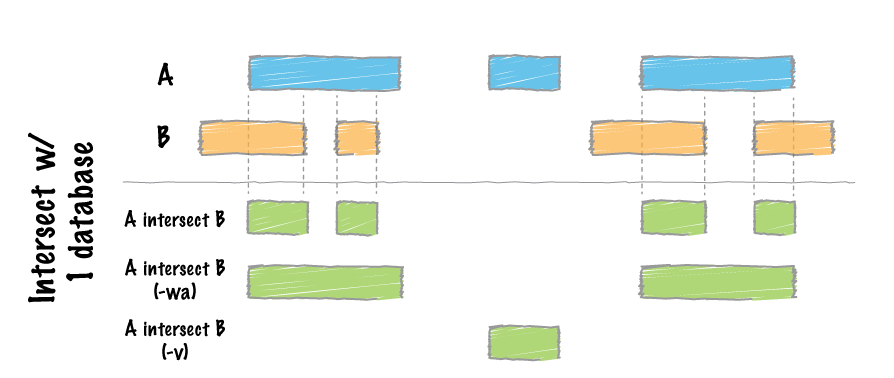
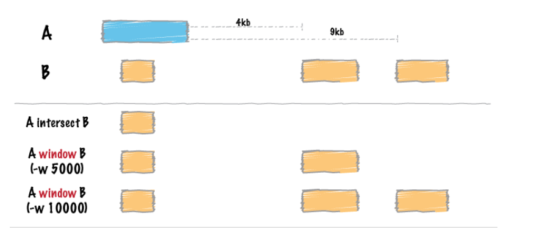

# Intersecting Variants with Genes of Interest

After identifying genome-wide variants (SVs, SNPs, and indels) using genome alignment and read mapping, the next step is to determine whether any of the marker genes associated with visible phenotypes in our strains are affected by mutations. To do this, we focus on variants that overlap or are near genes of interest. Module 3.1 showed how to obtain genomic coordinates of these genes from FlyBase. Here, we use command-line tools like `awk` and `bedtools` to narrow down candidate variants.

---

## Objectives
1. Filter and intersect variants with genes of interest to identify candidate mutations for visible phenotypes.

---

## Prerequisites
- Variant calls from whole-genome alignment (SVMU output) or read mapping (FreeBayes and Sniffles VCF output)
- BED file containing gene coordinates from FlyBase
- Installed tools:  
  - `bedtools`

---

## Part 1: Filtering Variants with `awk`

Both SVMU outputs and VCF files are tab-delimited, which makes them easy to parse with `awk`.

### Example: SVMU Output
Suppose we are working with strain **BL554**, which carries an allele of the *Ultrabithorax* gene (*Ubx*<sup>bx-1</sup>). From FlyBase, *Ubx* is located at **3R:16,656,623–16,734,426** in the ISO1 reference genome. The first three columns of the SVMU output represent chromosome, start, and end coordinates of SVs. We can filter for variants within the *Ubx* span:

```bash
awk '$1 == "3R" && $2 >=16656623 && $3 <=16734426 {print}' sv.BL554_scaffs_iso1ref.txt > BL554_ubx_svs.txt
```

Explanation:
- `$1 == "3R"` : restrict to chromosome 3R
- `$2 >=16656623` : variant start must be inside the gene
- `$3 <=16734426` : variant end must be inside the gene
- `&&` : these characters mean **and** - when we add this in between our conditions this means conditions on both sides of `&&` should be true. So in this case the 1st column should be 3R **and** the 2nd column must be greater than or equal to 16,656,623 **and** the 3rd column must be less than or equal to 16,734,426.
- `{print}` - print out the whole row if the three conditions are met
- Output is saved to `BL554_ubx_svs.txt`

This produces only SVs overlapping the *Ubx* gene. For example:

```
3R   16665752   16665759   CNV-Q   3R   17392527   17392534   0000006862   ...
3R   16665759   16665759   INS     3R   17391042   17392527   0000006863   ...
```

Similar logic can be applied to VCF files, where column 1 is the chromosome and column 2 is the position:

```bash
awk '$1 == "3R" && $2 >=16656623 && $2 <=16734426 {print}' BL554_iso1ref_freebayes.vcf > BL554_ubx_snps.txt
```

This filters SNPs within the *Ubx* gene span.

---

## Section 2: Intersecting Variants with `bedtools`

While `awk` works for single genes, programs like **BEDtools** can be used to perform comparisons and overlaps between interval files. BEDtools is sometimes referred to as the "swiss-army knife of genomics" as it has a wide range of utilities for performing analysis involving genomic intervals.

#### BEDtools `intersect`

We can use one of the utilities, **bedtools intersect**, to report variants overlapping a gene, or genes, of interest ([image source](https://bedtools.readthedocs.io/en/latest/content/tools/intersect.html)).

Basic usage:

```bash
bedtools intersect [OPTIONS] -a <FILE1> -b <FILE2> 
```




As shown in this diagram from the BEDtools documentation, if we have two interval files (BED,GFF, GTF, VCF) supplied by the `-a` and `-b` options, we can use BEDtools to find the intersection of the intervals in each file. So if we have a BED file containing our SV output from SVMU and a BED file with the coordinates of our genes of interest, we would do:

```bash
bedtools intersect -a BL662_mutated_genes.bed -b BL662_vs_ISO1.svmu -wa -wb > BL662_mutated_genes_SVMU_overlap.txt
```

Explanation:
- `-a` : file with gene intervals (BED)
- `-b` : file with variants (SVMU output or VCF)
- `-wa` : write full record from `a` (genes)
- `-wb` : write full record from `b` (variants)

Example output:
```
4     697689      721173     eyeless  4   700530    700892    DEL ...
4     697689      721173     eyeless  4   715457    720219    CNV-Q ...
4     1088798     1113317    shaven   4   1098028   1106434   CNV-Q ...
```
This will show us any mutations that overlap the genes *eyeless* and *shaven* which are both linked to visible mutations carried by strain BL662.


### Using `bedtools` with VCF
BEDtools natively recognizes VCF files:
```bash
bedtools intersect -a BL662_mutated_genes.bed -b BL662_iso1ref_freebayes.vcf -wa -wb > BL662_mutated_genes_freebayes_overlap.txt
```
This reports SNPs from FreeBayes overlapping *Ubx* or any other gene in the BED file.

### Adding Windows with `bedtools window`

`bedtools intersect` will show us any variants that overlap with our gene of interest, however, a mutation could affect a gene even if it does not directly overlap. Some genes have regulatory elements that lie outside the gene span, so mutations affecting those may not overlap the gene but still have an effect on it. To capture these types of mutations we could use the **bedtools window** function, which adds a specified number of basepairs upstream and/or downstream of the regions in a file ([image source](https://bedtools.readthedocs.io/en/latest/content/tools/window.html))




So if we wanted to identify mutations that overlap our gene of interest OR fall within 1 kb of our gene, we could do:

```bash
bedtools window -a BL662_mutated_genes.bed -b BL662_vs_ISO1.svmu -w 1000  > BL662_sv_gene_overlaps_1kbwindow.txt

```
### Flags explained
- `-a` : first file (gene BED).  
- `-b` : second file (SVMU variants from strain BL662). 
- `-w` : number of basepairs added upstream and downstream for each interval in `-a` file when searching for overlaps in `-b` file.  


This reports variants overlapping a gene or within 1 kb upstream/downstream.

---

## Key Takeaways
- Use `awk` for quick filtering on single genes.
- Use `bedtools` for scalable and flexible overlap analysis.
- `bedtools window` helps capture variants outside the gene span.
- Both approaches can be applied to SVMU outputs and VCF files.

---

## To Do
1. Practice filtering variants for one gene with `awk`.
2. Use `bedtools intersect` to find overlaps between variants and your gene set.
3. Try `bedtools window` to include nearby regulatory regions.

