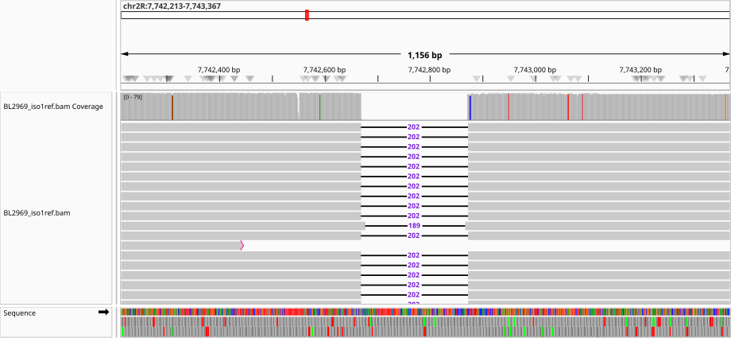

# Visualizing Variants in IGV

The **Integrative Genomics Viewer (IGV)** is a powerful desktop tool for exploring raw sequencing read alignments stored in BAM files. Unlike summary outputs from whole-genome alignments or variant calling software, IGV allows you to directly inspect the raw evidence- the reads themselves— and how they map to the reference genome. By visualizing this data, you can confirm predicted variants, identify structural rearrangements, and spot SNPs in their genomic context.

**Note:** Because reads are aligned to a single reference genome, there is always some degree of **reference bias** - variants that diverge strongly from the reference may be underrepresented or harder to detect. Keep this in mind when interpreting alignments.

In this tutorial, you’ll learn how to use IGV to interpret both structural variants and SNPs from read alignment data.

## Prerequisites

- A BAM file generated by aligning sequencing reads to the **Drosophila melanogaster** ISO1 reference genome.

- The corresponding BAM index file (.bai).

---

## Step 1: Install and Launch IGV

1. Download IGV: [https://igv.org/app](https://igv.org/app)  
2. Launch IGV and choose the genome using: **Genomes →  Select Hosted Genome** and from the dropdown list select **D. melanogaster (dm6)**.  
   - If not available, use **Genomes → Load Genome from File…** and select your FASTA (ex.`dmel-all-chromosome-r6.63.fasta`).

---

## Step 2: Load Your Data

1. Load your BAM alignment file:
   - `File → Load from File… → BL2969_iso1ref_sorted.bam`  
   - Also load the BAM index (`.bam.bai`) if IGV does not automatically detect it.

---

## Step 3: Navigate to Your Gene of Interest

1. Paste your FlyBase coordinates (ex. `2R:7782797-7785067`) into the IGV search bar.  
2. Press Enter.  
3. IGV will zoom to the gene region.  

## Breakdown of IGV Tracks

   - `Coverage`: A histogram of read depth
   - `Read alignments`: Individual reads with mismatches highlighted
   - `Annotation`: If you used the D. melanogaster (dm6) 'Hosted Genome' option, IGV will automatically include gene annotation as a track. You can also upload any annotation file (GTF, GFF, BED) to highlight regions of interest.

---

## Step 4: Interpret Variant Patterns

### 4.1 SNPs (Single Nucleotide Polymorphisms)
- **What you’ll see:**  
  - A pileup of reads where a single base differs from the reference.  
  - Reads with mismatches will show colored bases (A=green, C=blue, G=orange, T=red).  

In this example, a T (red) is replaced by an A (green) in all of the reads.

---

### 4.2 Deletions
- **What you’ll see:**  
  - A sharp drop in the coverage histogram.  
  - Reads with **black lines** (gaps) across the missing region. 

In this example, the reads show a deletion of ~202 bp which is why we see a sharp drop in coverage over the deleted sequence.

---

### 4.3 Duplications
- **What you’ll see:**  
  - A bump or **increase in coverage depth** compared to surrounding regions. This is because there are more copies of the sequence in the sample than in the reference, therefore more reads map to that sequence.  
  - Reads may be clipped or split (red bars at the end of reads) if they span the breakpoints of the duplicated sequence.  

---

### 4.4 Insertions
- **What you’ll see:**  
  - Inserted bases are shown as purple text in the read if they are small enough to fit within the aligned read.
  - If an insertion is larger than the read length, reads from this region may fail to align entirely or only align partially, with clipped bases visible at the edges in red. This highlights the problem of **reference bias**: sequences absent from the reference are more difficult to detect and characterize using read mapping alone, which is why genome-assembly and alignment remain the gold-standard for discovery of large mutations.

---

## Step 5: Save Evidence

- Use **View → Preferences → Save PNG/SVG** to export snapshots.  

---

## TO DO:
1. Navigate to the candidate genes/mutations associated with visible phenotypes in a strain to validate the variant calls generated by SVMU, Sniffles, or Freebayes.
2. Collect Snapshots of variant patterns observed as evidence supporting the presence of a candidate SV, SNP, or indel.
